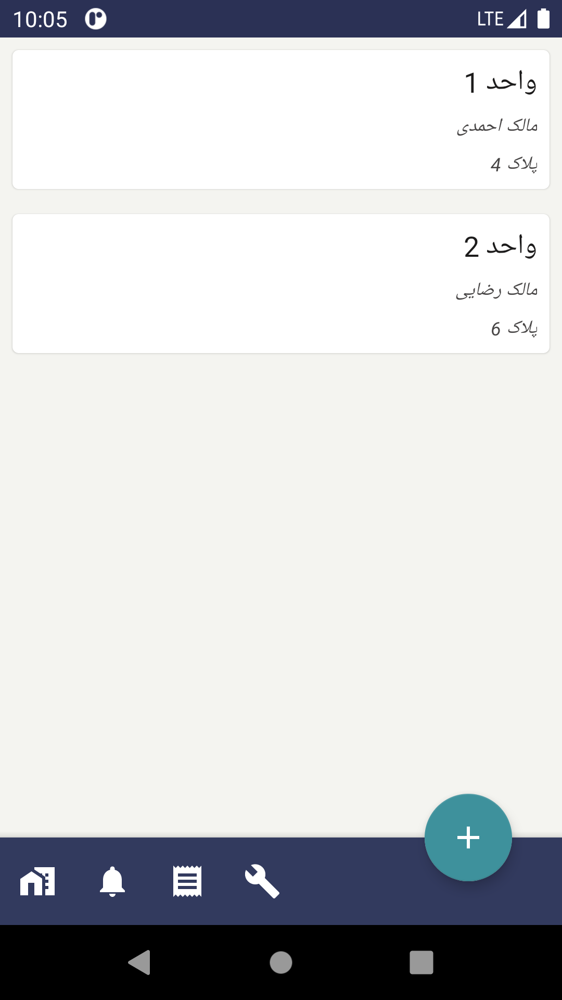
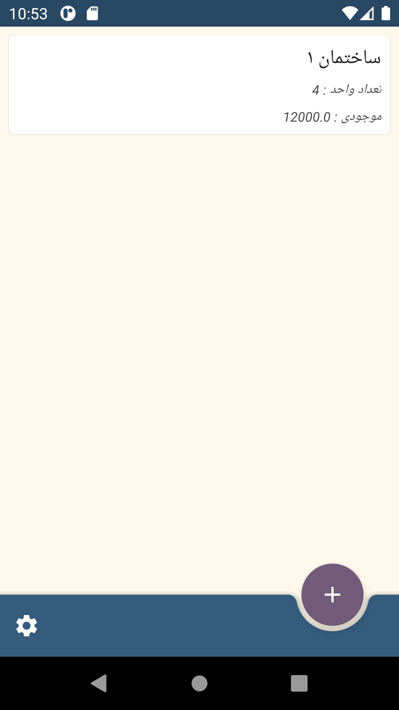
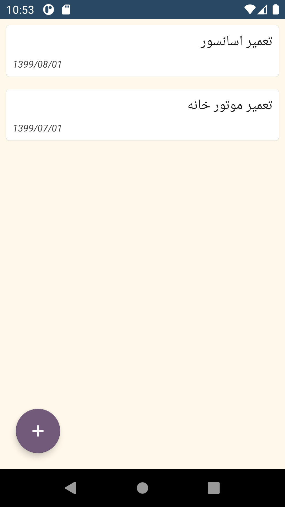
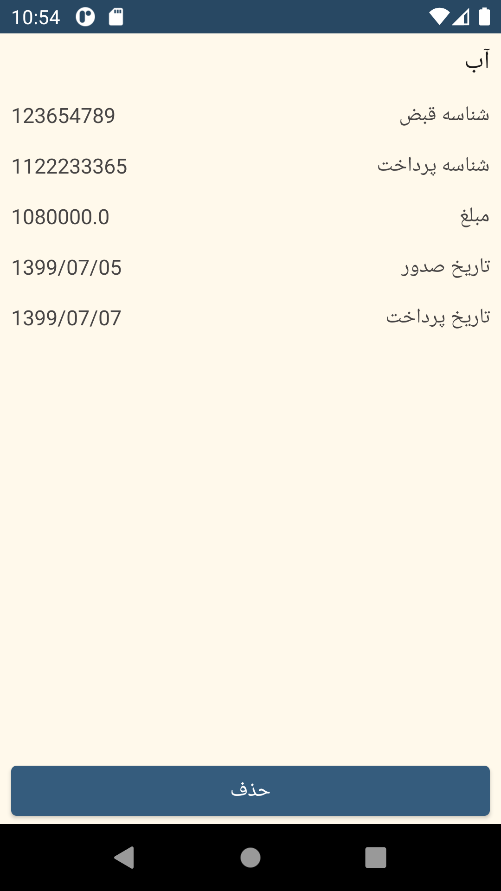
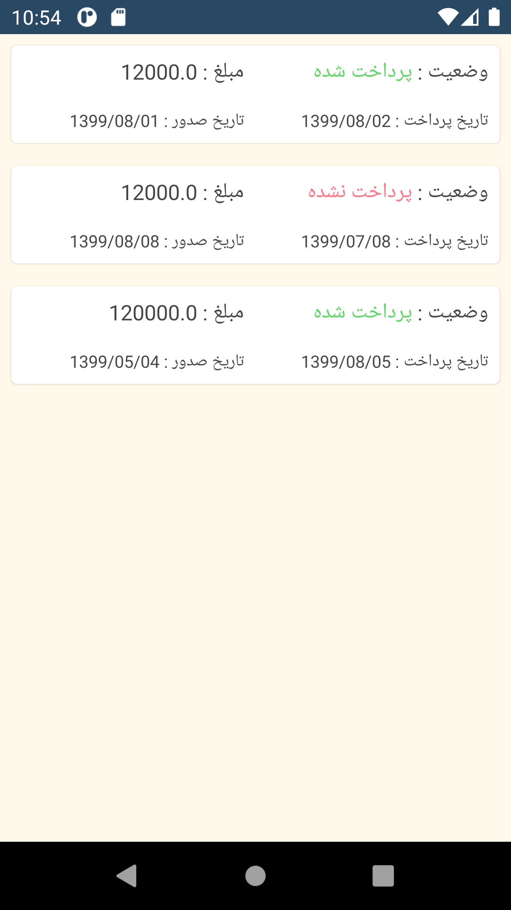
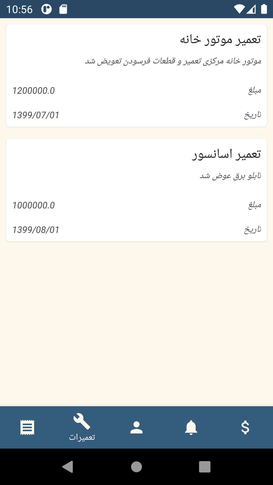

# Building_manager

  
  

    An android app to manage units of building. 
    You can manage more than one building with this app . Also you can manage repairs , receipts and charge of each unit. 
     
  

  
  <big>Some feature of this app:</big> 
  <ul>
    <li>manage more than one building with one app</li>
    <li>handle charge , receipt and repairs of building</li>
    <li>send notification for people who lives in building</li>
    <li>show information of specific unit of each building</li>
  </ul>
  
  &nbsp;
  
   
  &nbsp;
  
   
  &nbsp;
  
   
  
  

