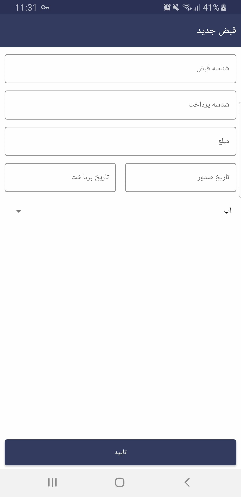

# Building_manager

### Description:
**Building Manaager** is an android app that makes for better interaction between building manager and building inhabitants. 
In this project building manager can manage some building and all people they inhabit in those buildings. also manager can register notificaion, receipt , repais and so on. 
This app is useful and useable for building managers and building inhabitants

### Installation:
For install this app you first need to fork project in you'r repository and clone that in you'r pc. 
open project in android studio and build project. 
Also you need Mysql  or Mariadb to create server side databse.To import data base on you mysql or mariadb you can use followin steps :
1. create a user for databse `CREATE USER user_name;`
1. create a database `CREATE DATABASE BUILDING_MANAGER`
1. import existing databse table into you'r database `mysql -u user_name -p BUILDING_MANAGER < BUILDING_MANAGER.sql`

you can find BUILDING_MANAGER.sql file in [Server Side app](https://github.com/SINAsoheili/Building_Manager_server_side) repository. 
For server side you must fork [Server Side app](https://github.com/SINAsoheili/Building_Manager_server_side) and use python 3 to run app.

### Images:

 
  &nbsp;
  &nbsp;
  &nbsp;
  &nbsp;
   
  
  &nbsp;
  &nbsp;
  &nbsp;
  &nbsp;
   
  
  &nbsp;
  &nbsp;
  &nbsp;
  &nbsp;
   
  
  &nbsp;
  &nbsp;
  &nbsp;
  &nbsp;
   
  
  &nbsp;
  

